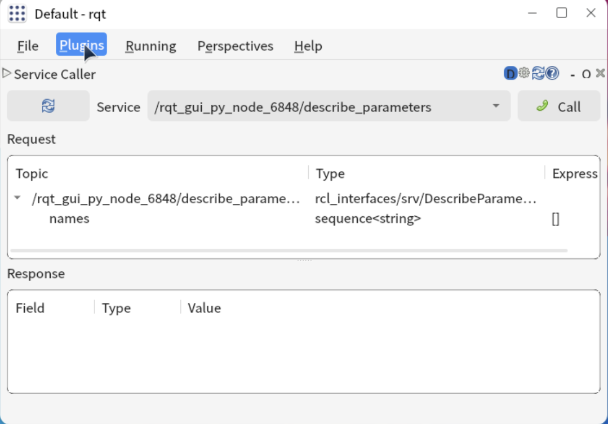
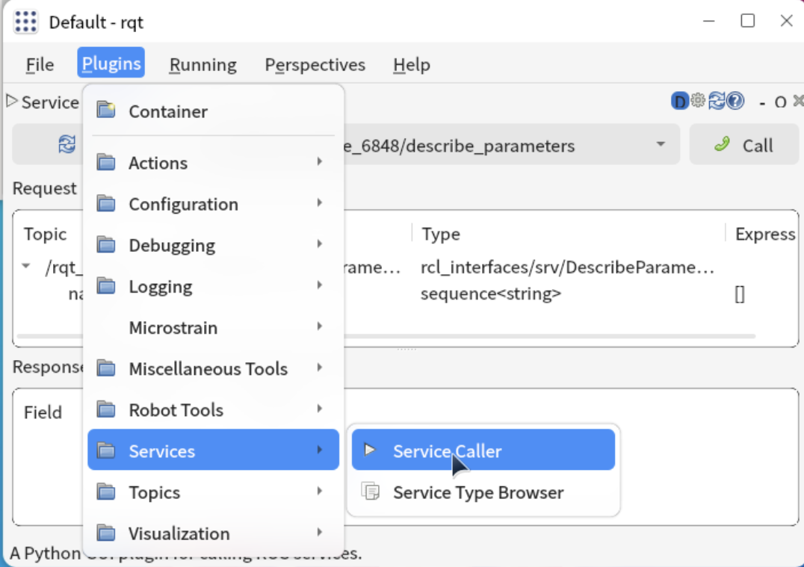
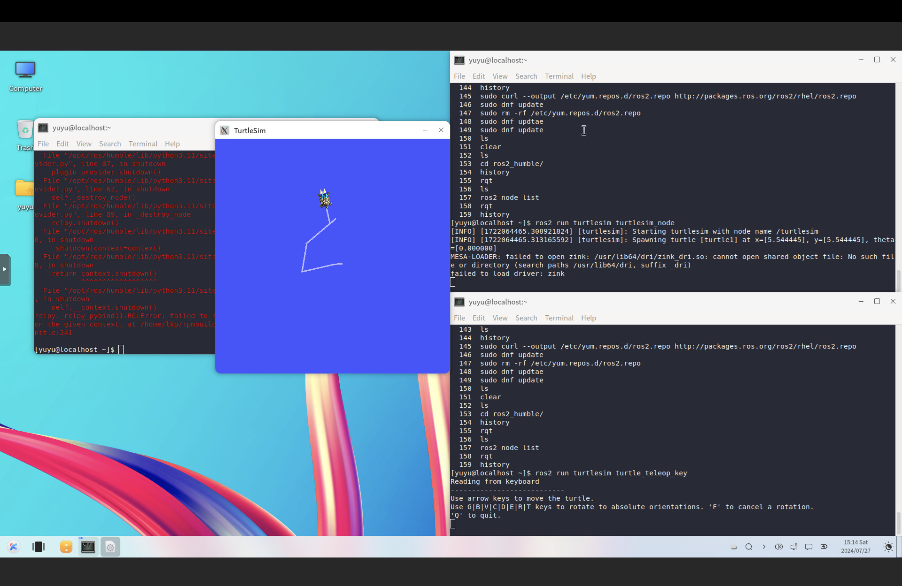
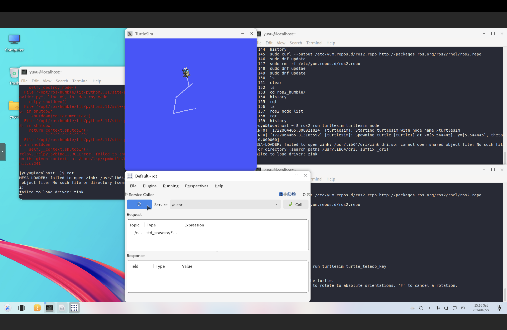
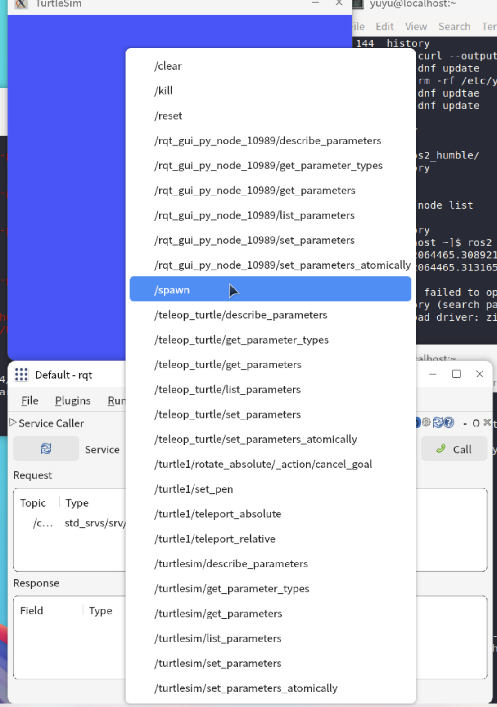
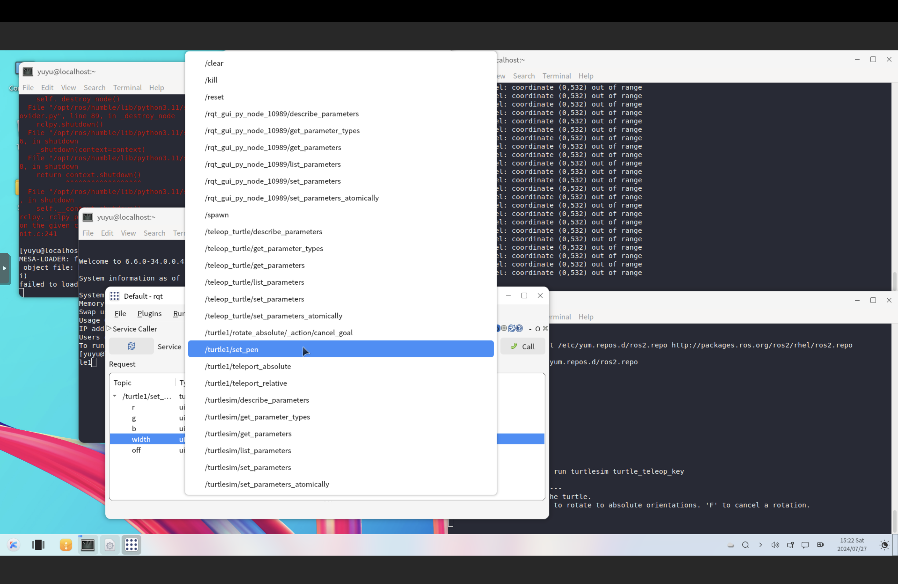
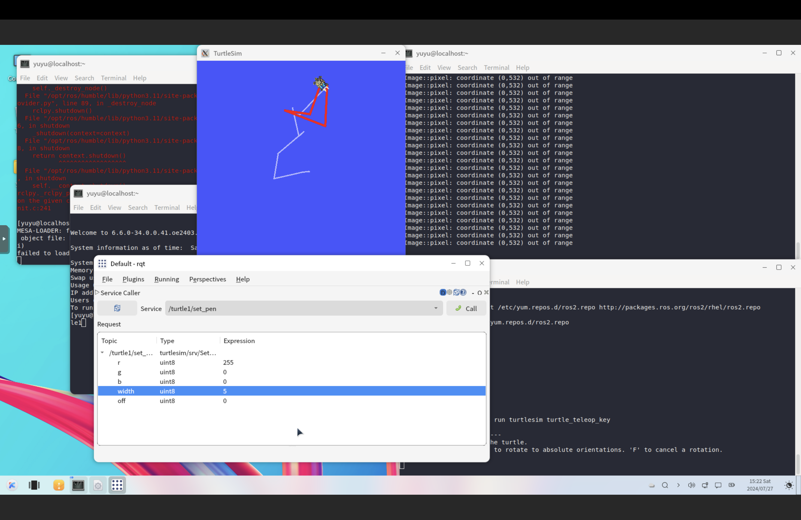
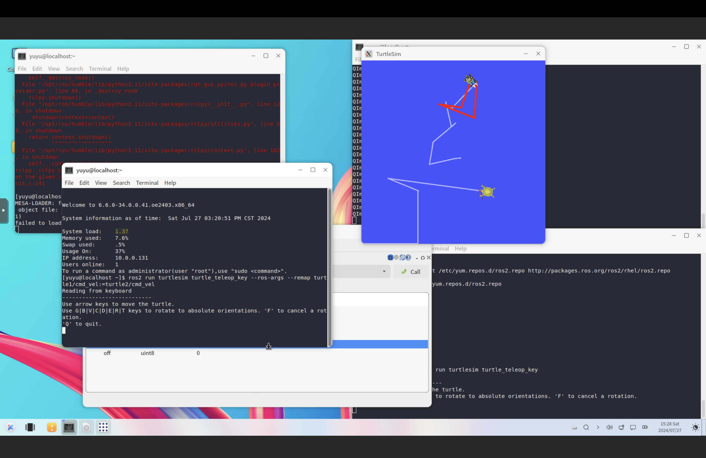

# rqt 使用

## 关于 `rqt`

`rqt` 指令在 ROS2 中提供了一个插件框架，执行该指令后会有一个如下图的图形化窗口弹出，该窗口的主要用途就是让不同的功能能够直观的呈现给开发者。



如果你是第一次使用 `rqt` 指令你可能会看到一个空的窗口，请点击菜单栏上的 `Plugins/Services/Service Caller` 进入如上图的界面。



## 使用 `rqt`

### 创建新的乌龟

以下示例使用 `rqt` 指令在前文的基础上，新增一个新的乌龟，并且操控这个新的乌龟。

请确保：

- 已经根据前文打开了一个新的乌龟
- 并且该乌龟可以正常操控

如下图：



请打开再打开一个新的窗口，并且输入指令 `rqt`

弹出 rqt 窗口后，根据下图的指针点击刷新按钮：



刷新成功后，点击选择框，根据指针选择 `/spawn` 指令，如下图：



根据下图，将 name 改为 turtle2，并且点击 call，就能看到左下角第二只乌龟出现。


### 改变乌龟移动轨迹颜色以及粗细

接着，我们可以试着让第一只乌龟的移动轨迹的颜色以及粗细。

首先，如下图点击选择框，根据指针选择 `/turtle1/set_pen`：



并且修改数值，再次点击 call：

- r -> 255
- width -> 5



如图可以看到乌龟的轨迹变成红色并且轨迹加粗。

### 让第二只乌龟动起来

请打开一个新的终端，并且输入以下指令：

```
ros2 run turtlesim turtle_teleop_key --ros-args --remap turtle1/cmd_vel:=turtle2/cmd_vel
```

