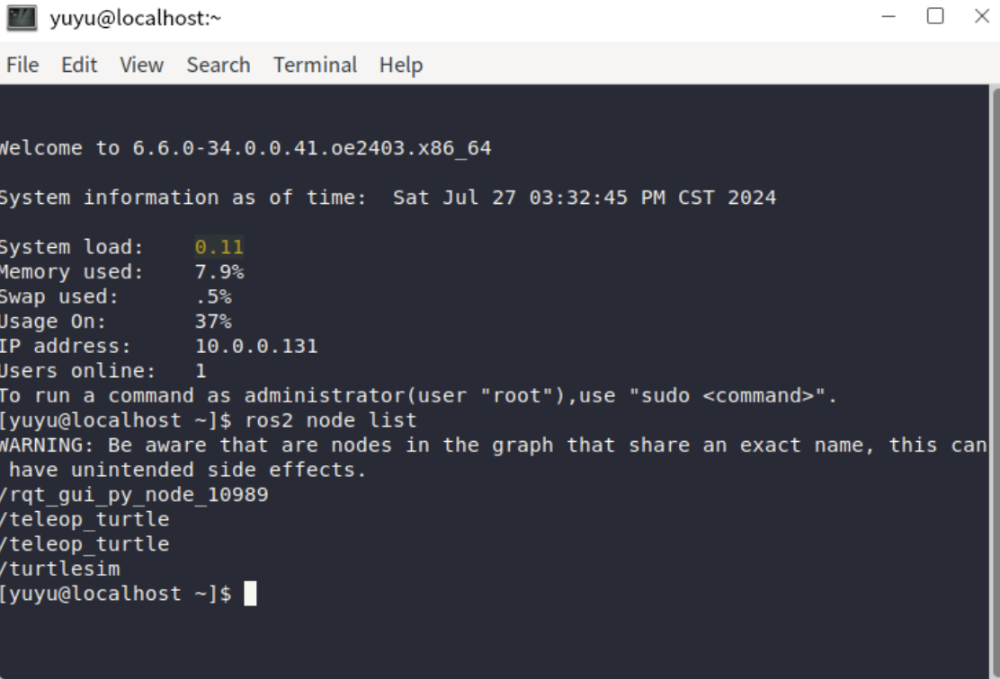
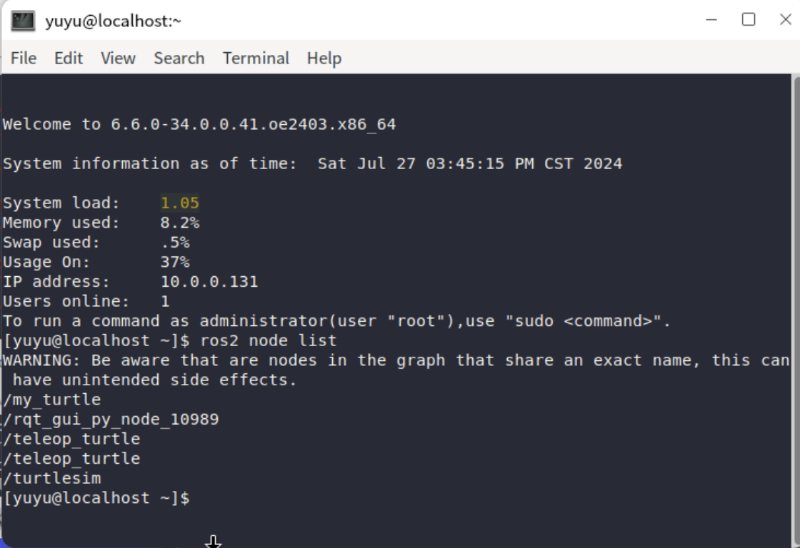
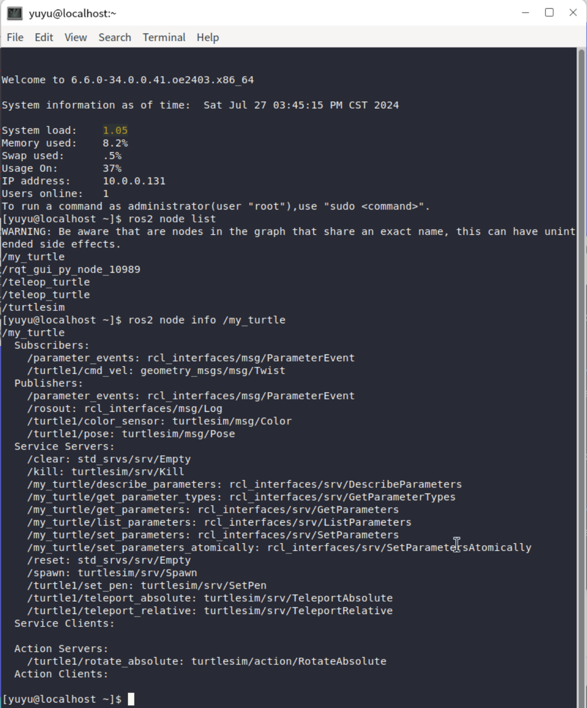

# 节点

## 查看节点

前文中，我们创建了两只乌龟，并且让他们成功的运动起来了，那么在小节中将介绍如何查看目前所有正在运行的节点。

创建一个新的窗口，并且输入如下指令：

```
ros2 node list
```



从上图可以看到所有列出的节点。

## 重新分配属性

该指令允许你将节点从默认的属性重新分配他们的属性，比如说节点的名称、主题名称、服务名称。

还记得在前文中，我们已经使用了 `--remap` 指令使得 cmd_vel 的 topic 以及 target 重新分配到了 turtle2（第二只乌龟） 吗？

```
ros2 run turtlesim turtle_teleop_key --ros-args --remap turtle1/cmd_vel:=turtle2/cmd_vel
```

那么我们现在使用 `--remap` 指令重新分配名字给我们的节点：

```
ros2 run turtlesim turtlesim_node --ros-args --remap __node:=my_turtle
```

这时你会启动一个新的 turtlesim 窗口，这是预期行为，再打开一个新的终端窗口，输入指令 `ros2 node list` 能够看到我们命名的 my_turtle 已经成功的运行了，并且出现在节点列表了。



## 查看节点信息

使用如下指令能够查看当前的节点的信息：

```
ros2 node info <node_name>
```

通过以下指令我们能够看到当前的 my_turtle 的节点信息：

```
ros2 node info /my_turtle
```

